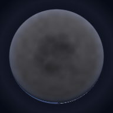
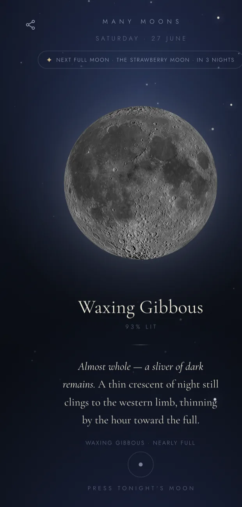
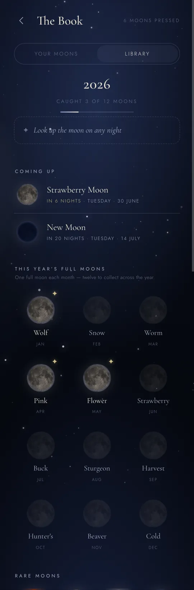
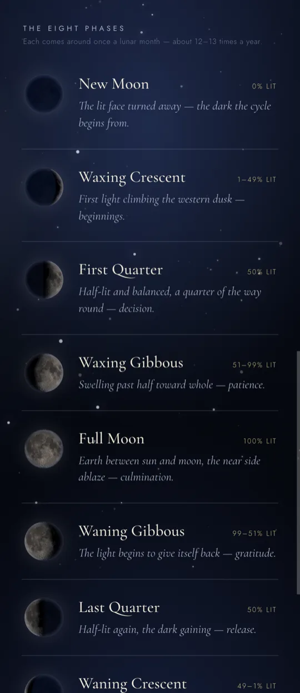
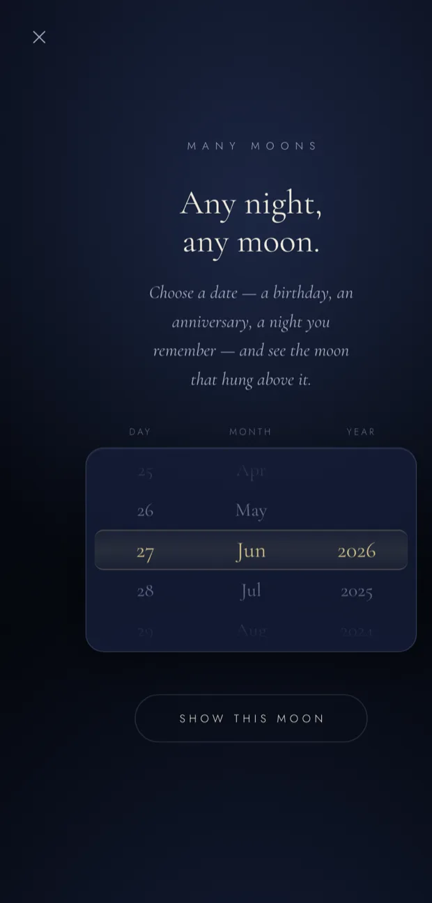
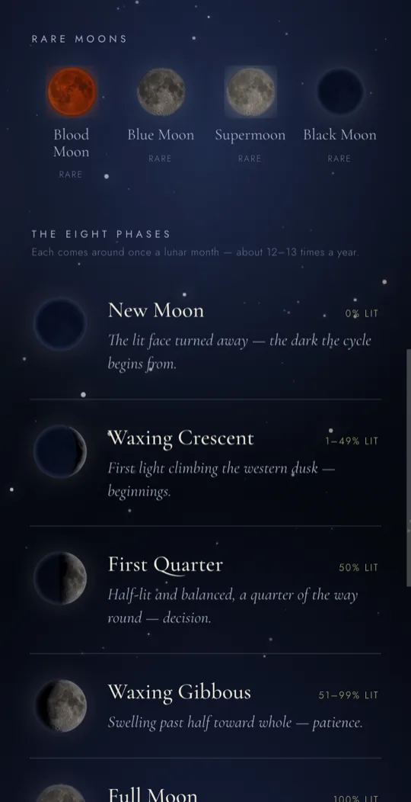
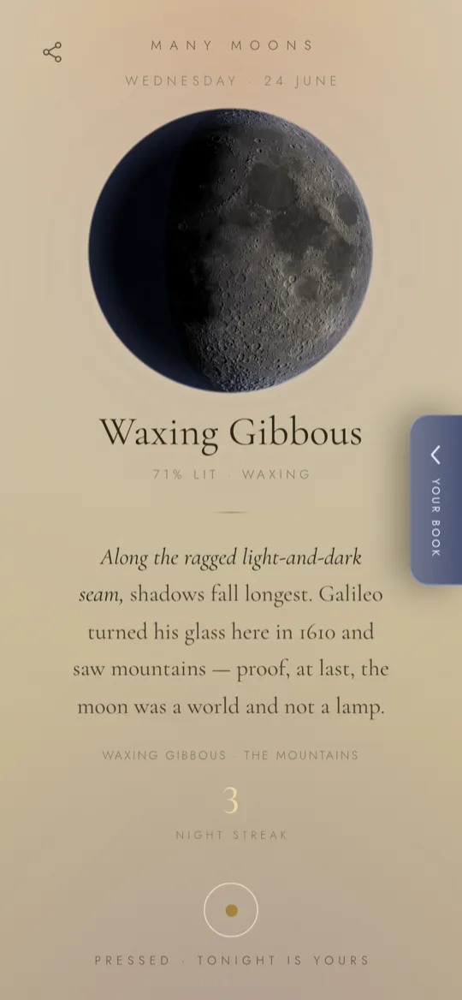
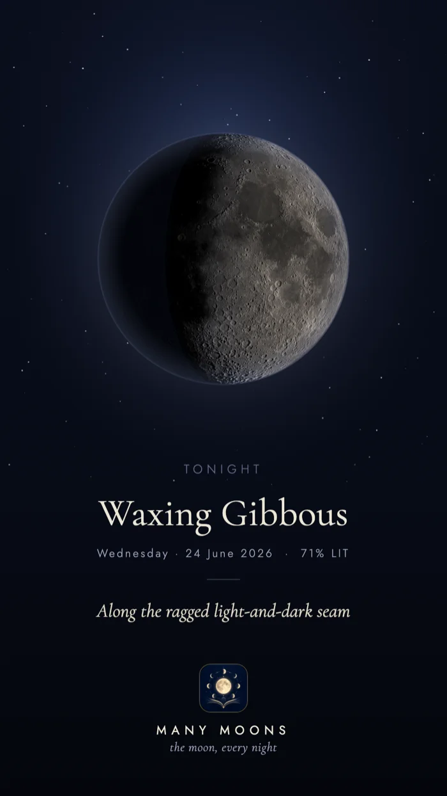

<p align="center">
  
</p>

<h1 align="center">🌙 Many Moons</h1>

<h3 align="center">The real moon overhead tonight — its phase, its lore,<br/>and a collection to keep.</h3>

<p align="center">
  
  
  
  
  
  
  
</p>

<p align="center">
  <b>A quiet companion for the moon overhead.</b> Open it any night and see the moon exactly as it hangs in the sky right now — the real lunar surface, lit by tonight's true shadow — beneath a short piece of folklore chosen for the night. Press the moon to keep it; over a lunar cycle your <b>Book</b> fills and a collection takes shape. <b>No account · no location · no tracking — it works offline.</b>
</p>

<p align="center">
  
</p>

---

<table align="center">
  <tr>
    <td align="center" width="33%"><br/><sub><b>Collect the moons</b></sub></td>
    <td align="center" width="33%"><br/><sub><b>The eight phases</b></sub></td>
    <td align="center" width="33%"><br/><sub><b>Any night, any moon</b></sub></td>
  </tr>
  <tr>
    <td align="center"><br/><sub><b>Rare &amp; special moons</b></sub></td>
    <td align="center"><br/><sub><b>Dusk light theme</b></sub></td>
    <td align="center"><br/><sub><b>Made to be shared</b></sub></td>
  </tr>
</table>

---

## 🌙 What it is

Many Moons opens to **Tonight** — the moon exactly as it hangs in the sky right now, the real lunar surface lit by the night's exact shadow, beneath one short piece of folklore chosen for the night.

Press the moon to keep it. Over a lunar cycle your **Book** fills with the moons you've watched, and a quiet collection takes shape: the year's twelve named full moons, waiting to be caught one night each. Tell it a birthday or any past date, and it will show you the moon that hung over it.

No account. No location. No tracking. It simply opens to the sky.

## 📱 The screens

- **Tonight** — the real current phase, its illumination, a hand-written lore card that turns each night, and your **press streak**.
- **The Book**
  - *Your Moons* — every moon you've pressed, newest first, each stamped with its date and how lit it was.
  - *The Collection* — the year laid out as a board: a *coming-up* list with countdowns, and the twelve full moons of the year as coins that light up as you catch them.
  - *The eight phases* and the year's named full moons (Wolf, Snow, Worm … Cold), each with its meaning.
- **Any night, any moon** — pick any past date on the glass **scroll wheels** and see — and share — the moon that hung above it.
- **Settings** — system-aware **dark / dusk** themes, an opt-in nightly reminder, and a one-tap backup of your collection.

> **Navigation** — swipe left/right to move between **Tonight → Your Moons → Library**, and the date wheels click softly under your thumb (toggle in Settings).

## ✨ Made to be shared

Press *share* on any moon and Many Moons paints a card — the moon, its phase and date, a line of lore, and the app's mark — ready for Stories, TikTok, or a message to someone who'd look up.

## 🌑 The moon, honestly rendered

- **Phase** is computed from the synodic month (29.530589 days) measured from a known new moon — global, exact to the day, and entirely offline.
- **The surface** is a real, public-domain NASA Lunar Reconnaissance Orbiter image of the near side.
- **The shadow** is the app's own: the true terminator for the night's exact phase, with raking light that deepens the craters near the shadow line, a warm sub-solar glow cooling to the terminator, and **earthshine** faintly lighting the dark limb — the way the real moon's unlit face glows by light reflected from Earth.
- **Blood moons** get their own coppery render; the twelve named moons and the supermoon, blue moon and black moon are recognised too.

## ▶️ Run it

It's a web app with no build step.

```bash
git clone https://github.com/thegreatLUCY/Manymoons.git
cd Manymoons
python3 -m http.server 8000
# then open http://localhost:8000
```

Or just open `index.html` in a browser. It installs as an offline **PWA**, and ships to Android via **Capacitor** — see [`CAPACITOR.md`](CAPACITOR.md).

## 📖 On the lore, and its sources

The folklore is hand-written and drawn from many traditions — Greek, Norse, Japanese, Chinese, Māori, and the North American almanac among them — paired in each card with a true fact about the sky. Care has been taken to credit each strand: the twelve month-names are a North American almanac gloss (several of Algonquin origin); the first-crescent *hilāl* of the Hijri calendar and the Māori *maramataka* are living calendars, still kept by looking up. Corrections from anyone closer to these traditions are warmly welcome.

## 🛠️ Built with

Vanilla HTML, CSS, and JavaScript in a single file · HTML `<canvas>` for the moon · NASA LRO imagery (public domain) · `localStorage` for your Book · Capacitor for Android · Cormorant Garamond and Jost for type. Mobile-first; happiest in portrait.

---

<p align="center"><sub>Same moon, different figure — wherever you're reading this from.</sub></p>
