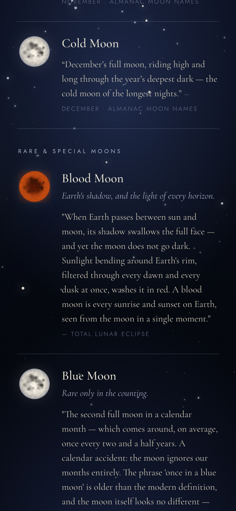
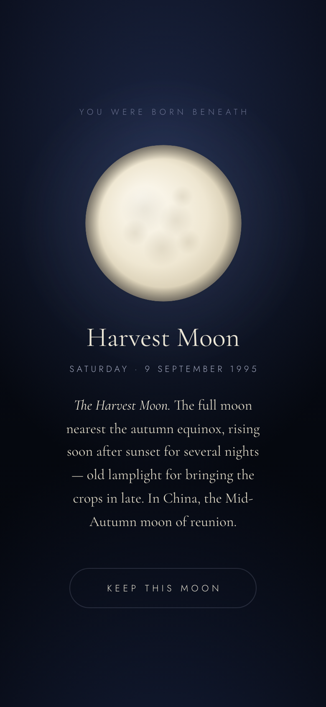
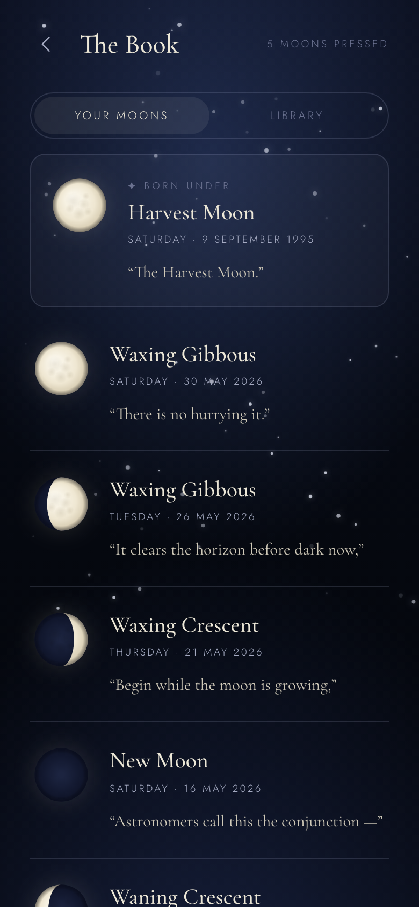
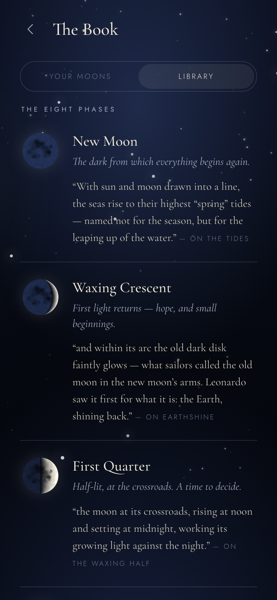

<h1 align="center">Many Moons</h1>

<p align="center">
  <em>A quiet companion for the moon overhead — tonight's phase, and the stories the world has told about it.</em>
</p>

| Blood Moon | Your birth moon | Your Moons | The Library |
|:--:|:--:|:--:|:--:|
|  |  |  |  |

---

## What it is

Many Moons opens to **Tonight** — the moon exactly as it hangs in the sky right now, drawn from astronomical math rather than a photograph, wrapped in a single short piece of folklore chosen for the night.

Press the moon to keep it. Over a lunar cycle your **Book** fills with the moons you've watched, each stamped with the night you pressed it. Tell it your birthday, and it will show you — and let you keep — the moon that hung over the night you were born.

No account. No location. No permissions. It simply opens to the sky.

## The screens

- **Tonight** — the real current phase, with an accurate terminator and a soft breathing glow, beneath one hand-written lore card. The card turns each night, so a lunar cycle never repeats itself.
- **Press to collect** — a small nightly ritual. Each pressed moon is saved with its phase and the date you pressed it.
- **Your birth moon** — enter a birthdate and watch the moon of that night resolve; keep it pinned to the front of your Book.
- **The Book**
  - *Your Moons* — your collection, newest first, your birth moon at the top.
  - *Library* — the eight phases and their meanings, and the year's twelve named full moons (Wolf, Snow, Worm … Cold).

## The moon, honestly rendered

- **Phase** is computed from the synodic month (29.530589 days) measured from a known new moon — global, exact to the day, and entirely offline.
- **The terminator** is drawn as the true ellipse (its half-width is the cosine of the phase angle), not a fudged crescent — so a waxing gibbous really is a waxing gibbous.
- **Earthshine** faintly lights the dark limb, the way the real moon's unlit face glows by light reflected from Earth.
- No images, no tile server, no API. One `<canvas>` and a little trigonometry.

## Run it

It's a single HTML file with no build step and no dependencies.

```bash
git clone https://github.com/thegreatLUCY/Manymoons.git
cd Manymoons
python3 -m http.server 8000
# then open http://localhost:8000
```

Or just open `index.html` directly in a browser. (A connection is used only to load the two webfonts.)

## On the lore, and its sources

The folklore is hand-written and drawn from many cultures — Greek, Norse, Japanese, Chinese, Māori, and the North American almanac tradition, among others. Care has been taken to credit each strand and not to flatten living practices into "myth": the twelve month-names are a North American almanac gloss (several of Algonquin origin); the first-crescent *hilāl* of the Hijri calendar and the Māori *maramataka* are living calendars, still kept by looking up. Corrections from anyone closer to these traditions are warmly welcome.

## Built with

Vanilla HTML, CSS, and JavaScript in a single file · HTML `<canvas>` for the moon · `localStorage` for your Book · Cormorant Garamond and Jost for type. Mobile-first; happiest in portrait.

---

<p align="center"><sub>Same moon, different figure — wherever you're reading this from.</sub></p>
